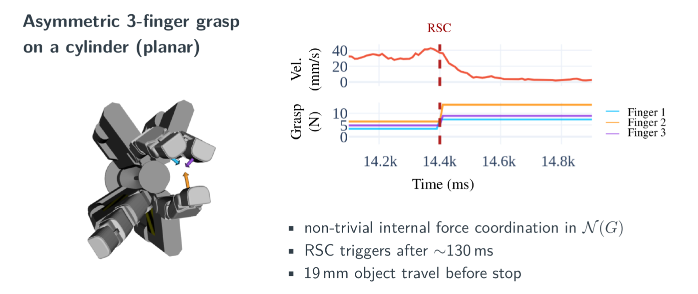

# Learning-Based Slip Detection for Adaptive Grasp Control

Project page for my PhD work:
Learning-based slip detection for adaptive grasp control in robotic manipulation

➡️ Project page: [https://thayral.github.io/reactive-slip-control/](https://thayral.github.io/reactive-slip-control/)
