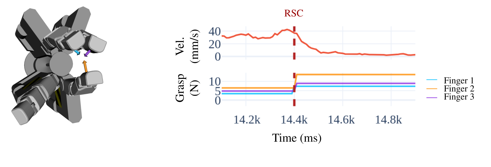

# Learning-Based Slip Detection for Adaptive Grasp Control

Project page for my PhD work:
Learning-based slip detection for adaptive grasp control in robotic manipulation

- Multi-contact, adaptive grasp stabilization
- Event-triggered reaction to slip (no friction modeling)
- Learning-based tactile perception + interpretable force control

➡️ Project page: [https://thayral.github.io/reactive-slip-control/](https://thayral.github.io/reactive-slip-control/)

**Paper accepted at ICRA 2026**
Reactive Slip Control in Multifingered Grasping: Hybrid Tactile Sensing and Internal-Force Optimization
Théo Ayral, Saifeddine Aloui, Mathieu Grossard

**Patent application:**
Robotic gripper and control method
M Grossard, S Aloui, T AYRAL
US Patent Application 19/011,931, 2025
