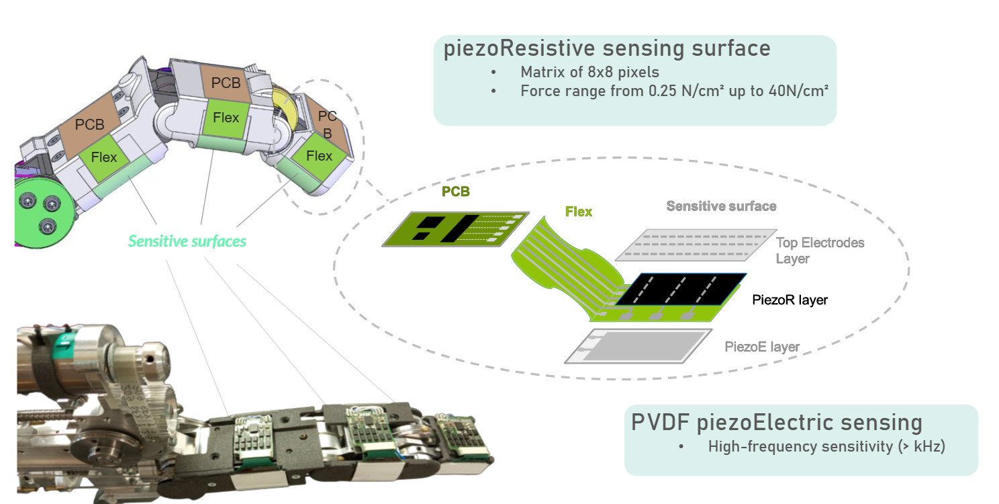
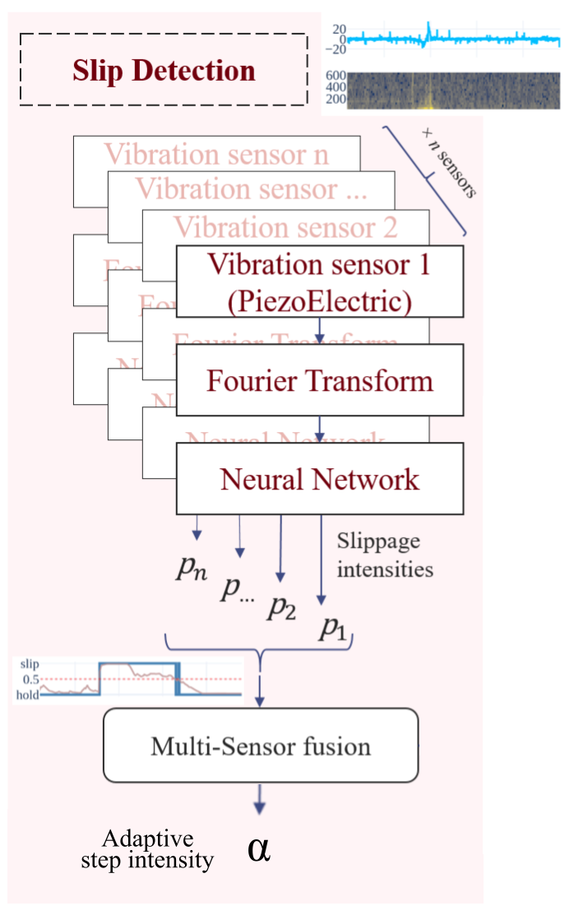
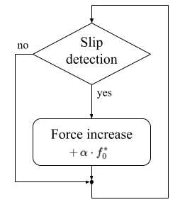
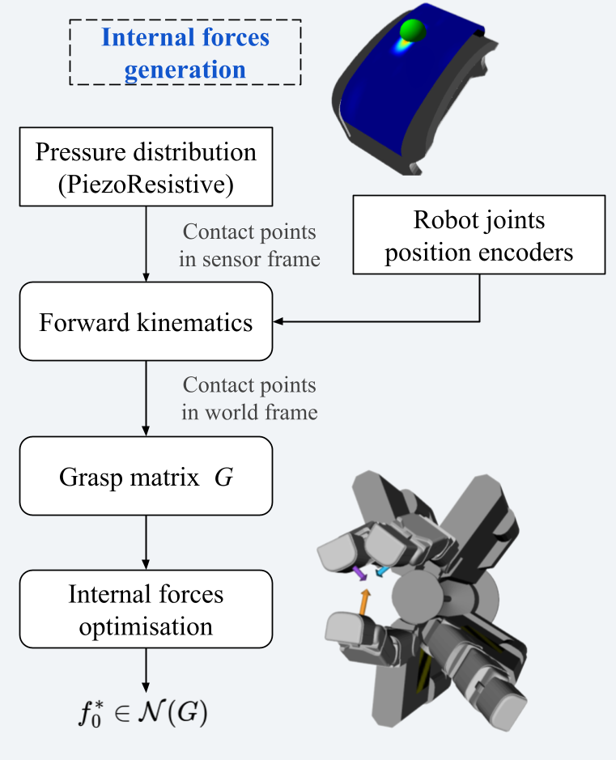
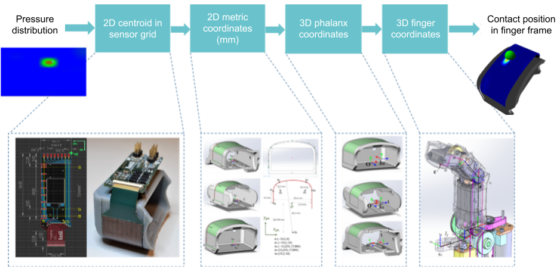
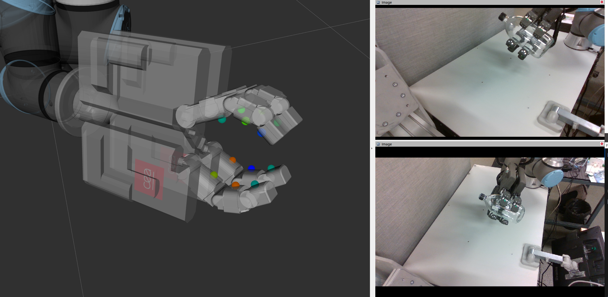

# Reactive Slip Control in Multifingered Grasping
Hybrid Tactile Sensing and Internal-Force Optimization

**Paper accepted for ICRA 2026**

[https://arxiv.org/abs/2602.16127](https://arxiv.org/abs/2602.16127)

Robotic manipulation in unstructured environments requires **stable grasps without excessive force**.
Humans solve this by sensing **incipient slip** and modulating grip forces rapidly.
This project investigates **learning-based slip detection** integrated into an **interpretable, model-based grasp stabilization loop**, enabling fast reactions and robust behavior in multi-fingered grasps.

keywords : grasp stability, internal forces, slip detection, multifingered gripper

  <a href="#contact">contact</a>

---

## Context project

  

    <a href="https://thayral.github.io/PhD-manipulation/" style="text-decoration:none; color:inherit;">
      <video autoplay loop muted playsinline style="width:100%; height:auto; display:block;">
        <source src="media/tracebot-process.mp4" type="video/mp4">
      </video>

      

      
    </a>

    

      

        <strong>TraceBot use-case & platform context</strong> 
        <a href="https://thayral.github.io/PhD-manipulation/" style="color:#444; text-decoration:underline;">
          Learn more on my PhD page   (setup, sensors, demos)
        </a>
      

      
    

  

## CONTRIBUTION
*Closed-loop grasp adjustment*
Stabilize multi-fingered grasp without explicit friction models.

Closed-loop adaptation of grasp forces
Stabilize multi-finger grasps by injecting internal forces without explicit friction models
Tactile feedback loop leveraging slip detection for short reaction time

---

## Problem: force coordination in multi-finger grasps {#problem}

In parallel-jaw grippers, preventing slip is often handled by a simple scalar increase of grip force.
In multi-finger grasps, the same strategy can inject an undesired net wrench and destabilize the object.
We target **slip-aware force coordination**: increase stability while preserving the object-level wrench.

  <table style="width:100%; border-collapse:collapse;">
    
    <tr>
      <td width="50%" align="center" valign="middle" style="padding:8px;">
        
      </td>
      <td width="50%" align="center" valign="middle" style="padding:8px;">
        
      </td>
    </tr>

<tr>
  <td width="50%" valign="top" style="padding:8px;">
    

      <strong>Simple gripper</strong>
    

    <ul style="text-align:left; margin:8px 0 0 8px;">
      <li><strong>Parallel jaws</strong>, single DoF</li>
      <li><strong>Scalar</strong> grasp-effort command</li>
    </ul>
  </td>

  <td width="50%" valign="top" style="padding:8px;">
    

      <strong>Multi-digit gripper</strong>
    

    <ul style="text-align:left; margin:8px 0 0 8px;">
      <li>Independent actuation of multiple-DoF fingers</li>
      <li>Requires <strong>coordination</strong> of contact forces</li>
    </ul>
  </td>
</tr>

  </table>

### Why internal forces matter

<table style="width:100%; border-collapse:collapse; margin: 24px 0;">
  
  <!-- Row 1: headers -->
  <tr>
    <td width="50%" align="center" valign="middle" style="padding:8px;">
      <strong>Uniform forces → Failure</strong>
    </td>
    <td width="50%" align="center" valign="middle" style="padding:8px;">
      <strong>Internal force coordination → Stable grasp</strong>
    </td>
  </tr>

  <!-- Row 2: videos -->
  <tr>
    <td width="50%" align="center" valign="middle" style="padding:8px;">
      <video autoplay loop muted playsinline style="width:95%; height:auto; display:block; margin:0 auto;">
        <source src="media/grasp_no_coordination.mp4" type="video/mp4">
      </video>
    </td>
    <td width="50%" align="center" valign="middle" style="padding:8px;">
      <video autoplay loop muted playsinline style="width:95%; height:auto; display:block; margin:0 auto;">
        <source src="media/grasp_with_coordination.mp4" type="video/mp4">
      </video>
    </td>
  </tr>

  <!-- Row 3: equation / explanation -->
  <tr>
    <td width="50%" align="center" valign="middle" style="padding:8px;">
      $$
      \|\mathbf{f}_1\| = \|\mathbf{f}_2\| = \|\mathbf{f}_3\|
      $$
      <em>Uniform force magnitudes ignore grasp geometry and lead to slip.</em>
    </td>
    <td width="50%" align="center" valign="middle" style="padding:8px;">
      <em>
        Internal forces injected in the null-space of the grasp matrix
        $\mathcal{N}(G)$ redistribute contact forces without disturbing object equilibrium.
      </em>
    </td>
  </tr>

</table>

---

## Tactile fingers - hybrid (PzE + PzR)

  

## Method Overview
We use a **hybrid learning + model-based** approach, with **two pipelines in parallel** and coupled through an **event-triggered feedback loop**:
- **Learned slip perception** from high-bandwidth tactile cues (FFT + GRU)
- **Online grasp model update** from contact localization
- **Event-triggered internal-force optimization** to stabilize the grasp without disturbing the object wrench

<table style="width:100%; border-collapse:collapse; margin:16px 0;">
  <tr>
    <td valign="middle" align="center" width="38%">
      
    </td>
    <td valign="middle" align="center" width="24%">
      
    </td>
    <td valign="middle" align="center" width="38%">
      
    </td>
  </tr>
</table>

  
<strong>Slip perception (PzE): training benches and signals</strong>

  

    <table style="width:100%; border-collapse:collapse;">
      <tr>
        <td width="22%" valign="middle" align="center" style="padding:6px;">
          
        </td>
        <td width="22%" valign="middle" align="center" style="padding:6px;">
          
        </td>
        <td width="56%" valign="middle" style="padding:6px; color:#444;">
          <strong>Slip detection module</strong> 
          The controller relies on a learning-based slip detector trained on dedicated benches.
          Data collection, perturbation modeling, and training are detailed on the project page. 
          <a href="https://github.com/thayral/tactile-slip-detection-pze">
            → Learn more about tactile slip detection
          </a>
        </td>
      </tr>
    </table>
  

  
<strong>Grasp geometry (PzR): contact point estimation</strong>

  

    Contact points are estimated from the PzR pressure map and mapped from <em>sensor coordinates</em> to <em>finger/world coordinates</em>
    to update grasp geometry online.

    

      
    

    <table style="width:100%; border-collapse:collapse;">
      <tr>
        <td width="67%" valign="middle" align="center" style="padding:6px;">
          
        </td>
        <td width="33%" valign="middle" align="center" style="padding:6px;">
          
        </td>
      </tr>
    </table>
  

---

## Experimental validation

**Asymmetric 3-finger grasp on a cylinder (planar)**  
- Internal force coordination in **null space of the grasp**  
- RSC triggers after ~**130 ms**  
- ~**19 mm** object travel before stop

  

## Reactive Slip Control in action
**“peg-out” canister extraction**

<table style="width:100%; border-collapse:collapse; margin: 24px 0;">
  <tr>
    <td width="50%" align="center" valign="middle" style="padding:8px;">
      <strong>Baseline → Failure (insufficient grasp force)</strong>
    </td>
    <td width="50%" align="center" valign="middle" style="padding:8px;">
      <strong>RSC → Success (slip-triggered force increase)</strong>
    </td>
  </tr>

  <tr>
    <td width="50%" align="center" valign="middle" style="padding:8px;">
      <video autoplay loop muted playsinline style="width:95%; height:auto; display:block; margin:0 auto;">
        <source src="media/canister_failure.mp4" type="video/mp4">
      </video>
    </td>
    <td width="50%" align="center" valign="middle" style="padding:8px;">
      <video autoplay loop muted playsinline style="width:95%; height:auto; display:block; margin:0 auto;">
        <source src="media/canister_rsc_success.mp4" type="video/mp4">
      </video>
    </td>
  </tr>

  <tr>
    <td width="50%" align="center" valign="middle" style="padding:8px;">
      <em>Object remains docked despite lifting motion.</em>
    </td>
    <td width="50%" align="center" valign="middle" style="padding:8px;">
      <em>Slip detected early → grasp effort increases → extraction succeeds.</em>
    </td>
  </tr>
</table>

---

## Latency

### Real-time loop & latency budget - theoretical compute
(optimized in-loop compute budget excluding I/O-heavy prototype constraints).

| Block | Estimate |
|------|----------|
| FFT (C impl., 20 ms window) | < 0.1 ms compute (windowing delay ~13 ms) |
| GRU inference (Python/ONNX) | ~3 ms (model decision delay ~24 ms) |
| PzR → contact + 𝒩(G) update | ~5 ms |
| QP solve (OSQP) for internal-force update | ~4 ms |
| **Net slip-reaction latency (target)** | **~35–40 ms** |

---
**Paper accepted at ICRA 2026**
*Reactive Slip Control in Multifingered Grasping: Hybrid Tactile Sensing and Internal-Force Optimization*

Théo Ayral, Saifeddine Aloui, Mathieu Grossard

## Contact
Théo AYRAL

➡️ This work is part of the PhD thesis   
**Learning-based slip detection for adaptive grasp control**  
CEA (Leti & List) · Université Paris-Saclay   
[https://github.com/thayral/PhD-manipulation](https://github.com/thayral/PhD-manipulation)
