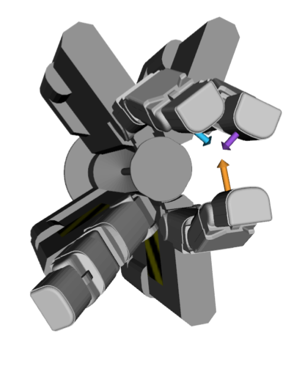
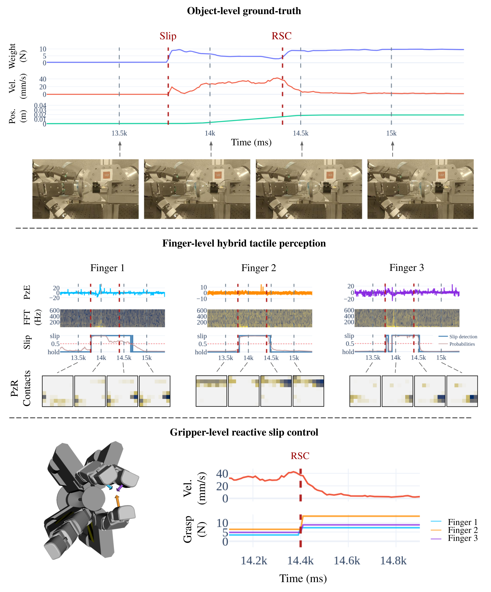

# Learning-based slip detection for adaptive grasp control in robotic manipulation

**PhD Thesis Project — Théo Ayral**  
CEA (Leti & List) · Université Paris-Saclay

  <a href="#publications">Publications</a> ·
  <a href="#code--resources">Code & Resources</a> ·
  <a href="#setup--benches">Setup</a> ·
  <a href="#method">Method</a> ·
  <a href="#results">Results</a> ·
  <a href="#latency">Latency</a>

---

## Video

<!-- Vimeo embed (works on GitHub Pages) -->

  

    <iframe
      src="https://player.vimeo.com/video/1056472782?h=0&title=0&byline=0&portrait=0"
      style="position:absolute; top:0; left:0; width:100%; height:100%;"
      frameborder="0"
      allow="autoplay; fullscreen; picture-in-picture"
      allowfullscreen>
    </iframe>
  

---

## Context

Robotic manipulation in unstructured environments requires **stable grasps without excessive force**.
Humans solve this by sensing **incipient slip** and modulating grip forces rapidly.
This project investigates **learning-based slip detection** integrated into an **interpretable, model-based grasp stabilization loop**, enabling fast reactions and robust behavior in multi-fingered grasps.

## Problem: force coordination in multi-finger grasps {#problem}

In parallel-jaw grippers, preventing slip is often handled by a simple scalar increase of grip force.
In multi-finger grasps, the same strategy can inject an undesired net wrench and destabilize the object.
We target **slip-aware force coordination**: increase stability while preserving the object-level wrench.

<table>
  <tr>
    <td width="45%" valign="top" align="center">
      
        
      <strong>Simple gripper</strong>
      <ul align="left">
        <li><strong>Parallel jaws</strong>, single DoF</li>
        <li><strong>Scalar</strong> grasp-effort command</li>
      </ul>
    </td>
    <td width="55%" valign="top" align="center">
      
        
      <strong>Multi-digit gripper</strong>
      <ul align="left">
        <li>Independent actuation of multiple-DoF fingers</li>
        <li>Requires <strong>coordination</strong> of contact forces</li>
      </ul>
    </td>
  </tr>
</table>

<em>Takeaway: slip recovery in multi-finger grasps is not a scalar “grip harder” action — it must coordinate contact forces.</em>

---

## Code & Resources

> Remplace les liens par tes repos / pages.

- **Demo (minimal runnable example):** https://github.com/thayral/<demo-repo>
- **Training / research code (implementation details):** https://github.com/thayral/<training-repo>
- **Slides (full, for deep dive):** https://thayral.github.io/phd-defense-slides/
- **Thesis manuscript (PDF):** https://github.com/thayral/<thesis-repo-or-pdf-link>

---

## Setup & benches

### TraceBot / manipulation platform
- Multi-finger gripper with **hybrid tactile sensing**
- PzE: high-bandwidth friction-vibration sensing (slip cues)
- PzR: spatial pressure/contact localization (contact geometry update)

<!-- TEMPLATE: image (static figure / photo) -->

  

<em>Figure: Multi-finger gripper instrumented with hybrid tactile pads.</em>

### Data collection benches
We rely on automated and parameterized benches to generate labeled slip events under controlled variability (object, speed, force, grasps) and to collect **non-slip perturbations** that mimic slip-like dynamics.

<!-- TEMPLATE: GIF for bench -->

  

<em>Automated bench for slip trajectory generation with ground-truth signals.</em>

---

## Method

### Overview
We use a **hybrid learning + model-based** approach:
- **Learned slip perception** from high-bandwidth tactile cues (FFT + GRU)
- **Online grasp model update** from contact localization
- **Event-triggered internal-force optimization** to stabilize the grasp without disturbing the object wrench

<!-- TEMPLATE: method schema -->

  

<em>Overview of the reactive slip control (RSC) pipeline.</em>

### Spectro-temporal features (PzE signal → FFT/PSD → Spectrogram)

<table>
  <tr>
    <!-- LEFT: stacked signal + spectrogram -->
    <td width="68%" valign="top">
      <strong>PzE signal (sliding window)</strong>  
      <video autoplay loop muted playsinline width="100%">
        <source src="media/fft_pze.mp4" type="video/mp4">
      </video>

        

      <strong>Spectrogram (built over time)</strong>  
      <video autoplay loop muted playsinline width="100%">
        <source src="media/fft_spectro.mp4" type="video/mp4">
      </video>
    </td>

    <!-- RIGHT: tall FFT/PSD -->
    <td width="32%" valign="top" align="center">
      <strong>FFT → PSD</strong>  
      <video autoplay loop muted playsinline width="100%">
        <source src="media/fft_frames.mp4" type="video/mp4">
      </video>
    </td>
  </tr>
</table>

<em>High-bandwidth PzE signals are processed in short windows. FFT yields PSD features; successive spectra build the spectrogram used for slip classification.</em>

## Generating perturbations for training {#perturbations}

<table>
  <tr>
    <td width="55%" valign="top">
      <strong>Perturbation taxonomy</strong>
      <ul>
        <li><strong>ΔFn</strong> — Grasp effort variations: normal force (tighten / release)</li>
        <li><strong>ΔFt</strong> — External load variations: tangential load (shear / traction)</li>
        <li><strong>Δq</strong> — Actuation noise: structural vibrations</li>
      </ul>
      <em>Goal: reduce false alarms while preserving sensitivity to real slip.</em>
    </td>
    <td width="45%" align="center" valign="top">
      
    </td>
  </tr>
</table>

    \includegraphics[width=\linewidth]{chap2/fig/perturbdef/neo de Perturbations rarity labells.pdf}

    
###  Contact point estimation

    \includegraphics[width=\textwidth]{chap3/fig/coordinates image sensor (1).pdf}
    \includegraphics[width=0.6\textwidth]{Backups/pzr points sim.png}%
    \quad\includegraphics[width=0.3\textwidth]{Backups/pzr points visu.png}
---

## Results

### Experimental validation (example)
**Asymmetric 3-finger grasp on a cylinder (planar)**  
- Internal force coordination in **null space of the grasp**  
- RSC triggers after ~**130 ms**  
- ~**19 mm** object travel before stop

<!-- Put your key result figure / montage here -->

  

<!-- Optional: GIF showing the stabilization -->

  

---

## Latency

### Real-time loop & latency budget (theoretical compute)
This section summarizes the optimized in-loop compute budget (excluding I/O-heavy prototype constraints).

| Block | Estimate |
|------|----------|
| FFT (C impl., 20 ms window) | < 0.1 ms compute (windowing delay ~13 ms) |
| GRU inference (Python/ONNX) | ~3 ms (model decision delay ~24 ms) |
| PzR → contact + 𝒩(G) update | ~5 ms |
| QP solve (OSQP) for internal-force update | ~4 ms |
| **Net slip-reaction latency (target)** | **~35–40 ms** |

---

## Publications

- **AIM 2023 (published)**  
  *Spectro-Temporal Recurrent Neural Network for Robotic Slip Detection with Piezoelectric Tactile Sensor*  
  Théo Ayral, Saifeddine Aloui, Mathieu Grossard

- **(in preparation)**  
  *Robust Tactile Slip Detection under Manipulation Perturbations*  
  Théo Ayral, Saifeddine Aloui, Mathieu Grossard

- **ICRA 2026 (accepted)**  
  *Reactive Slip Control in Multifingered Grasping: Hybrid Tactile Sensing and Internal-Force Optimization*  
  Théo Ayral, Saifeddine Aloui, Mathieu Grossard

- **Patent application (2025)**  
  *Robotic gripper and control method*  
  M. Grossard, S. Aloui, T. Ayral — US Patent Application 19/011,931
---

## Contact

- Email: <your.email@cea.fr>
- Scholar / website: <link>
- GitHub: https://github.com/thayral
